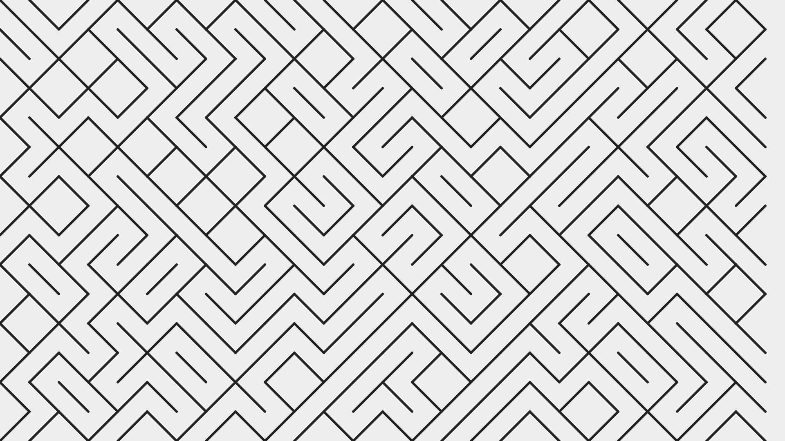
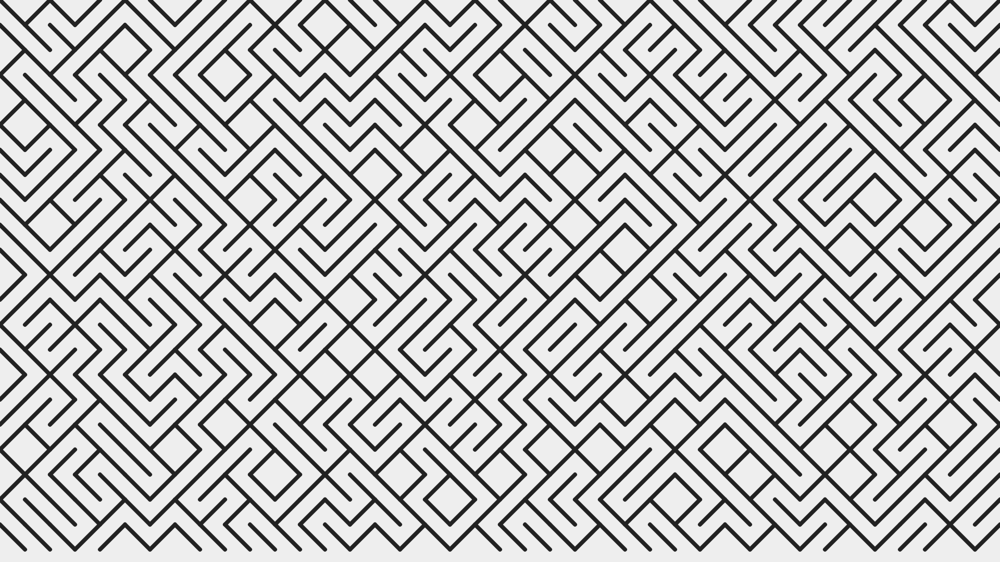
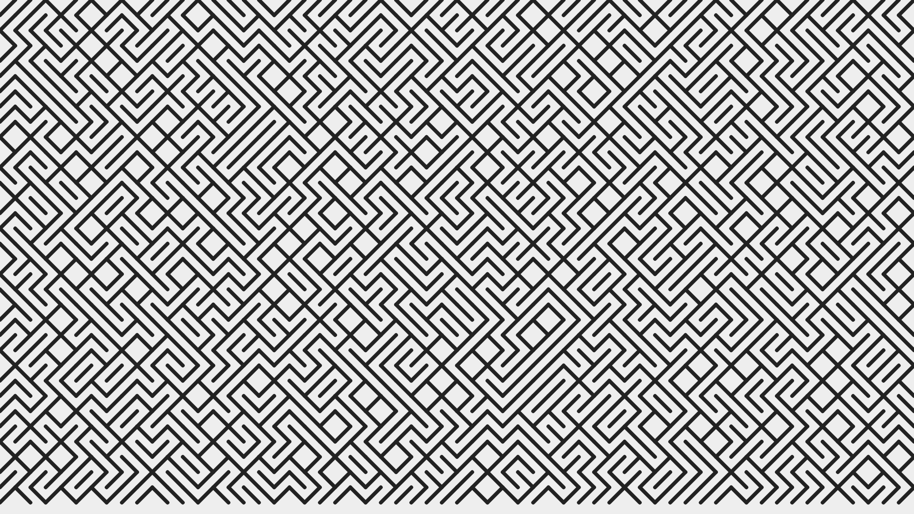
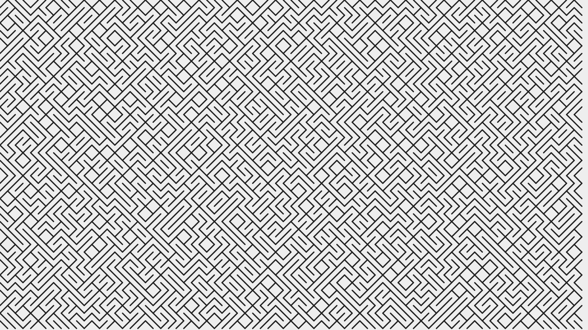
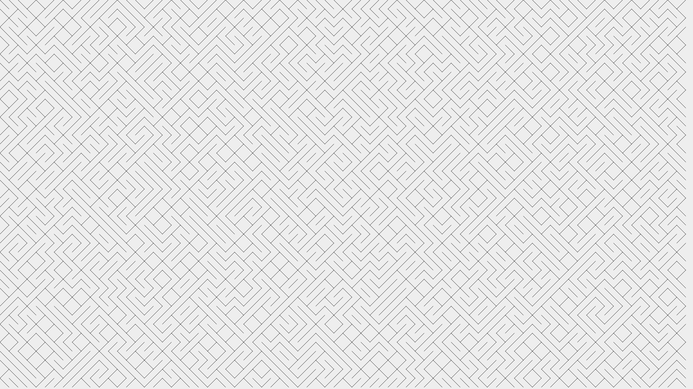

# 10print

The classic C64 one-liner maze art.

```basic
10 PRINT CHR$(205.5+RND(1)); : GOTO 10
```

Which prints the [PETSCII](https://sta.c64.org/cbm64pet.html) code 205 (for backslash `\`) or 206 (for forward slash `/`) at random, forever.

## Screenshots

|                             |                             |                             |
| --------------------------- | --------------------------- | --------------------------- |
|  |  |  |
|  |  |  |
|  |  |  |

## Config

```
npm install
```

## Run

```
npm start
```
