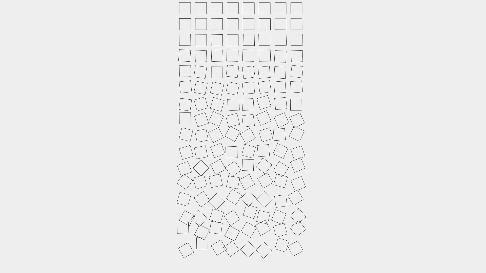
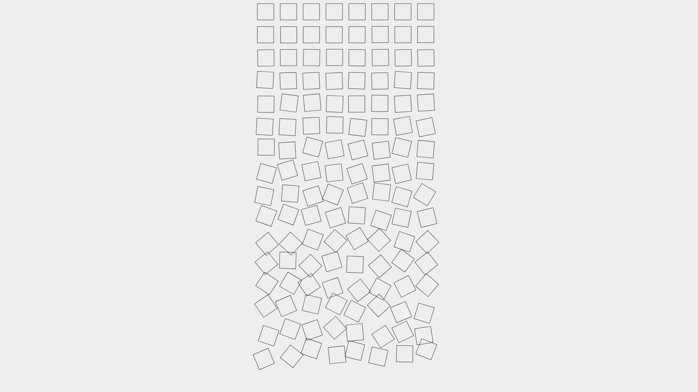
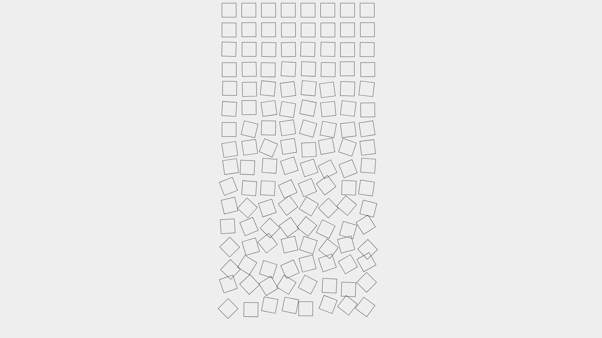
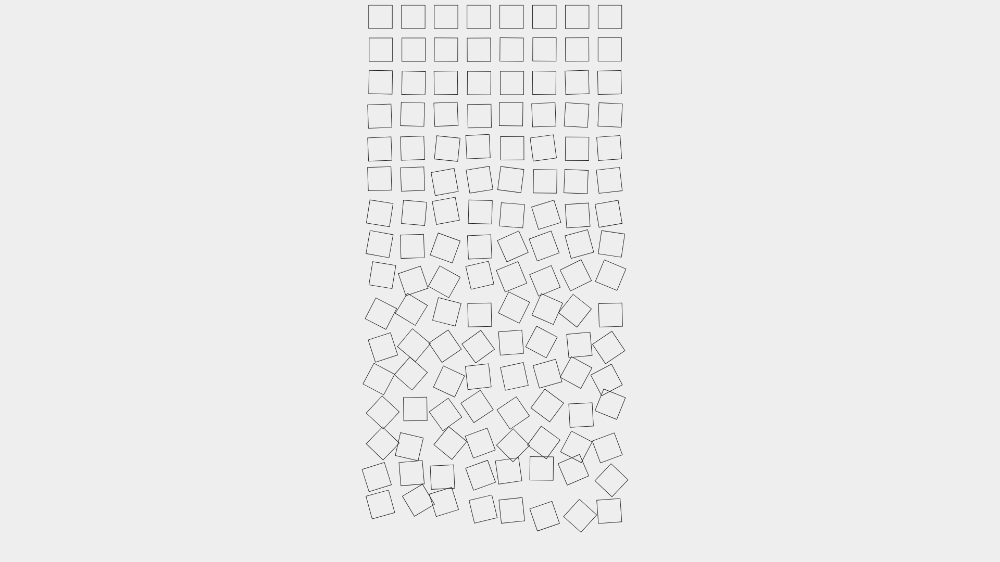
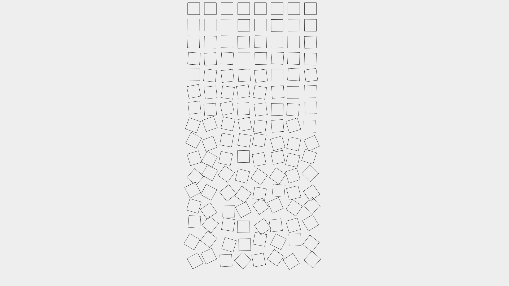
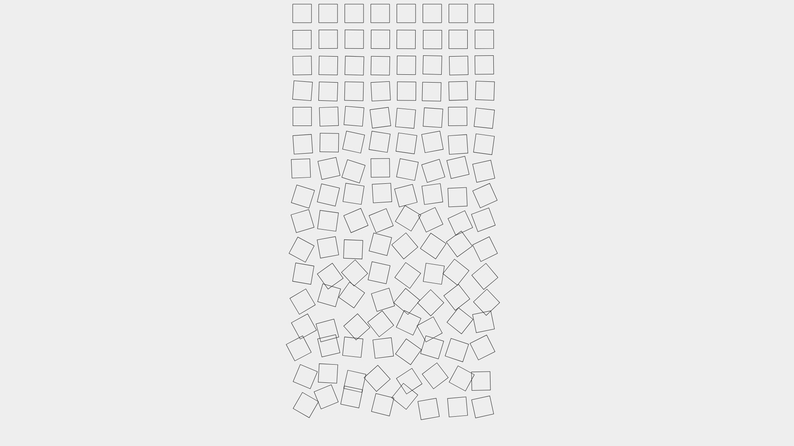

# Loop + Tile

Grid of squares built with a loop with ever increasing randomness in the style of Georg Nees.

## Screenshots

|                             |                             |                             |
| --------------------------- | --------------------------- | --------------------------- |
|  |  |  |
|  |  |  |
|  |  |  |

## Config

```
npm install
```

## Run

```
npm start
```
