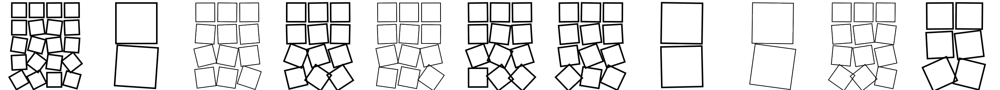
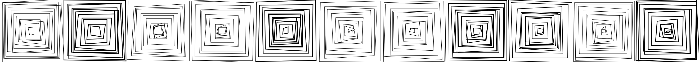
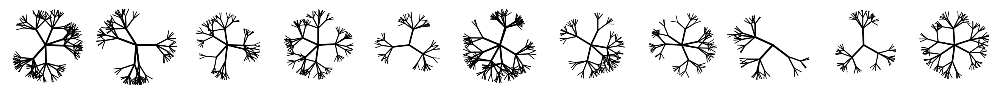
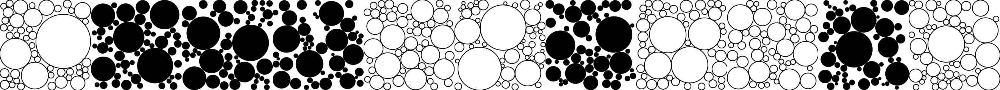
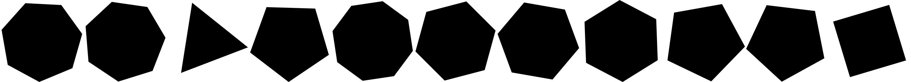

# Quilt

A generated _quilt_ assembled from individual generated patches.

## Contribute a Square Patch

Contribute your own square patch by importing the `Patch` function type from `app.ts`, exporting a function named `patch` conforming to that type, and saving your TypeScript file in `src/`.

For example, save this as `src/sqr.tx`:

```ts
import type { Patch } from "./app";

export const patch: Patch = function (buf) {
    const sz = buf.width;
    buf.noStroke();
    buf.fill(0);
    buf.square(0, 0, sz);
};
```

## Example Patches

| File     | Example Patches             |
| -------- | --------------------------- |
| `ex1.ts` |  |
| `ex2.ts` |  |
| `ex3.ts` |  |
| `ex4.ts` |  |
| `ex5.ts` |  |
| `ex6.ts` |  |
| `js1.ts` |  |
| `js2.ts` |  |
| `js3.ts` |  |
| `js4.ts` |  |

## Config

```sh
npm install
```

## Run

```sh
npm start
```

## Automation

We want a updating quilt display...automatically.

So, when new patches are added to the quilt and merged into `main`, we want our local display (say on a TV) to be updated _automatically_ with those new patches.

Our local display update flow is:

1. Merge PR with new patch into `main`
2. GitHub sends webhook to a server ([smee](https://smee.io))
3. Server receives the webhook, but proxy it to local app
4. Local app ([puller](../puller)) pulls the updated quilt code from GitHub
5. Monitor sees the filesystem changes and triggers a redraw

### PR Check

A simple check, implemented in Python and run via Pytest, ensures that every TypeScript file in `src/` has exactly this line:

```ts
export const patch: Patch = function (buf) {
```

You can also run this check locally via Pytest (you'll need to have Python 3.12, plus the Pytest package installed):

```sh
pytest -v tests
```

### Patch Codegen

As PRs containing new patches are merged into `main`, `patch.py` generates TypeScript code in `app.ts` to include all new patches in the quilt. And when we have at least one _user_ patch, the existing example patches will be excluded.

You can run it locally (you'll need to have Python 3.12 installed):

```sh
python patch.py
```

### Webhook Proxy

We use [smee](https://smee.io) to receive the GitHub webhook on the server and proxy it down to our local machine.

Install `smee` globally:

```sh
npm install -g smee-client
```

Start the local `smee` proxy, forwarding webhooks to the [puller](../puller):

```sh
smee -u https://smee.io/jOKVZWzuJ7M5sMIG -t http://localhost:3000/webhook
```

### Puller

The smee proxy sends the webhook to the [puller](../puller), which then runs `git pull origin main` to grab the latest code.

Start the puller:

```sh
npm start
```

Puller runs at:  
http://localhost:3000/webhook

### Watcher

We could use something fancier like [nodemon](https://nodemon.io), but the [parcel](https://parceljs.org) development server is sufficient.

Just run the quilt:

```sh
npm start
```

Which just runs (see [package.json](package.json))

```sh
parcel serve index.html --open -p 8010
```

Lastly, the quilt will redraw itself every 1 minute.
